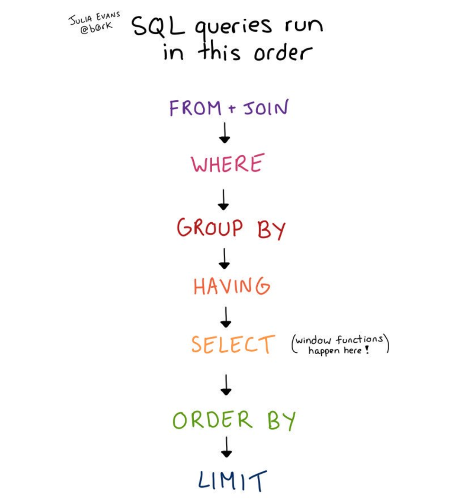

# SQL 查询执行顺序


日常使用中写 SQL 查询命令都是以 SELECT 开始的（注意：本文仅探讨 SELECT 查询，不涵盖 insert 或其他 SQL 命令）。

昨天我想到一个问题：可以用 WHERE、HAVING 或者其他方式来过滤窗口函数执行结果吗？

经过一番探索，我得出的最终结论是否定的，因为窗口函数必须在 WHERE 和 GROUP BY 之后才能运行。但是，这也延伸到了一个更大的问题——SQL 查询的执行顺序是怎么样的呢？

## SQL 查询执行顺序

我专门查了一下文档 SQL 查询执行顺序如下：



如果不喜欢以上五彩斑斓的图片形式，也可以看下面的文字：

1. `FROM/JOIN/ON`
2. `WHERE`
3. `GROUP BY`
4. `HAVING`
5. `SELECT`（窗口函数即在此步骤执行）
6. `ORDER BY`
7. `LIMIT`

**上图可以解答你的如下疑惑：**

上图是 SQL 查询的语义说明。看懂这张图，便能迅速判断一个给定的 SQL 查询将会返回什么结果，也可以轻松解答如下疑问：

- 可以对 `GROUP BY` 的结果进行`WHERE` 筛选吗？（不可以！因为 WHERE 在 GROUP BY 之前执行）
- 可以对窗口函数的执行结果进行过滤吗？（不可以！因为窗口函数在 SELECT 步骤执行，而这步是在 WHERE 和 GROUP BY 之后）
- 可以对 `GROUP BY` 的结果再执行 `ORDER BY` 操作吗? （可以！`ORDER BY` 基本上是最后一个步骤了，所以可以对任何操作的执行结果执行 `ORDER BY`)
- `LIMIT` 执行在哪个步骤? （最后一步！）

**虽然如此，但实际上数据库引擎并非严格按照这个顺序运行查询**，因为它们还会执行一系列的优化，以便提升查询速度。

所以：

- 当你想了解查询语句的有效性，或是想搞明白为什么会返回这样一个查询结果时，可以尝试用该图来解释；
- 但是，使用该图是无法解释查询性能或索引相关问题的，它们会涉及到更多变量，因而也更为复杂。

## 一、最容易搞混的：列别名

比如：关联姓和名，并对其进行分组。SQL 语法是允许这样写：

```
SELECT CONCAT(first_name, ' ', last_name) AS full_name, count(*)
FROM table
GROUP BY full_name
```

上面的查询看起来像是在 `SELECT` 之后执行 `GROUP BY`，但其实 `GROUP BY`是先执行的，因为 `GROUP BY` 引用了 `SELECT` 中的 `alias`。

数据库引擎是可以将查询重写为：

```
SELECT CONCAT(first_name, ' ', last_name) AS full_name, count(*)
FROM table
GROUP BY CONCAT(first_name, ' ', last_name)
```

接着，先执行 `GROUP BY` 中的语句，再进行 `SELECT` 操作，所以上面那么写是可行的。

此外，数据库引擎肯定会执行一系列检查，以确保在查询开始运行之前，`SELECT` 和 `GROUP BY` 中的内容相匹配，因此在制定执行计划之前，它必须将查询语句当作一个整体来检查。

## 二、查询并非严格按照此顺序运行（优化）

实际上，数据库引擎并不是通过连接、过滤和分组来运行查询，因为它实现了一系列优化来提升查询速度，如重新排序（只要不影响最终返回结果）。

这里列举一个简单的例子来说明查询的执行顺序是如何影响了查询性能。

```
SELECT * FROM
owners LEFT JOIN cats ON owners.id = cats.owner
WHERE cats.name = 'mr darcy'
```

如果只需要查找 3 个名为“mr darcy”的猫，那么执行整个左连接并匹配这两个表中的所有行是很慢的。相反，如果先对名为“mr darcy”的猫进行筛选再去执行连接，则要快得多。在这种情况下，先执行过滤不会改变查询的结果！

实际上，数据库引擎还实现了许多其他的优化，使得查询语句以另外的顺序来执行，这里暂且不表。

## 三、不一样的查询语法

LINQ（C# 和 VB.NET 中的查询语法）是按照`FROM ... WHERE ... SELECT`的顺序来执行查询。以下是 LINQ 查询的示例：

```
var teenAgerStudent = from s in studentList
                      where s.Age > 12 && s.Age < 20
                      select s;
```

Pandas（Python 数据统计分析工具）也基本上是这样工作的，尽管有时候不需要严格按照下面的顺序来编写代码，但这样也不失为一种好习惯：

```
df = thing1.join(thing2)      # like a JOIN
df = df[df.created_at > 1000] # like a WHERE
df = df.groupby('something', num_yes = ('yes', 'sum')) # like a GROUP BY
df = df[df.num_yes > 2]       # like a HAVING, filtering on the result of a GROUP BY
df = df[['num_yes', 'something1', 'something']] # pick the columns I want to display, like a SELECT
df.sort_values('sometthing', ascending=True)[:30] # ORDER BY and LIMIT
df[:30]
```

这并不是因为 Pandas 的强制规定，只是按照 JOIN/WHERE/GROUP BY/HAVING 的顺序来编写代码更有助于理解底层逻辑。(值得一提的是，可以在 JOIN 之前先执行 WHERE 来提高性能，大多数数据库引擎在实践中也是这样来执行的）

R 中的 dplyr（R 语言用来操作数据框的包）还允许采用不同的语法查询不同的 SQL 数据库，如：Postgres、MySQL 和 SQLite。


> 原文地址：SQL queries don't start with SELECT
>
> 原文作者：Julia Evans（已授权）
>
> 译者 & 校正：HelloGitHub-小熊熊 & 卤蛋
