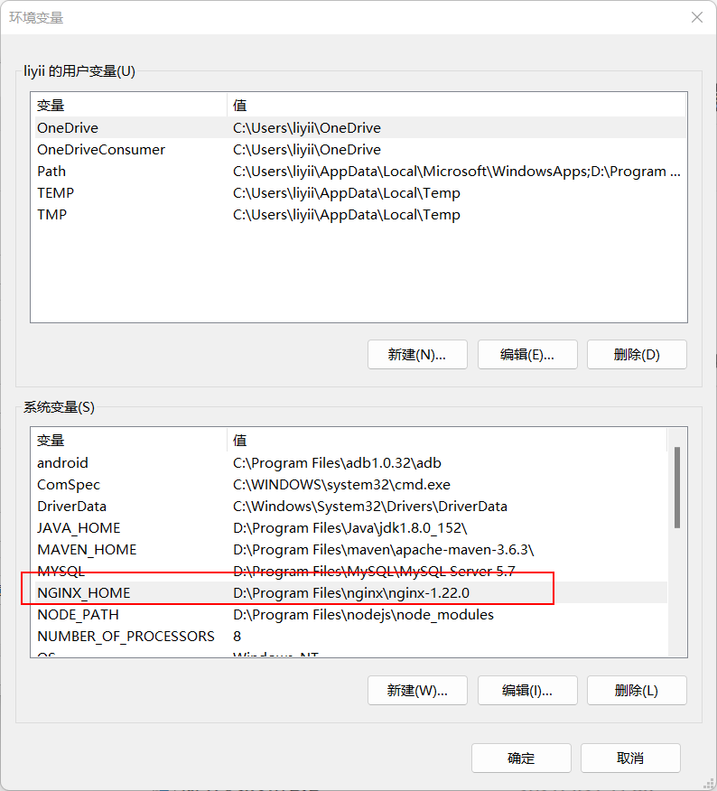
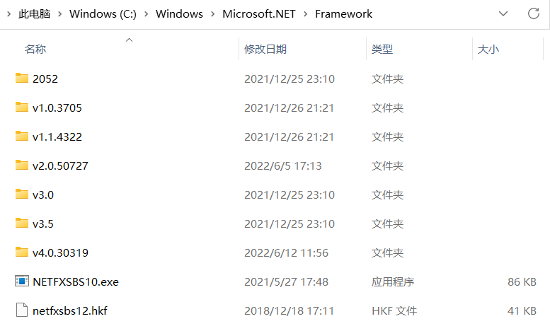
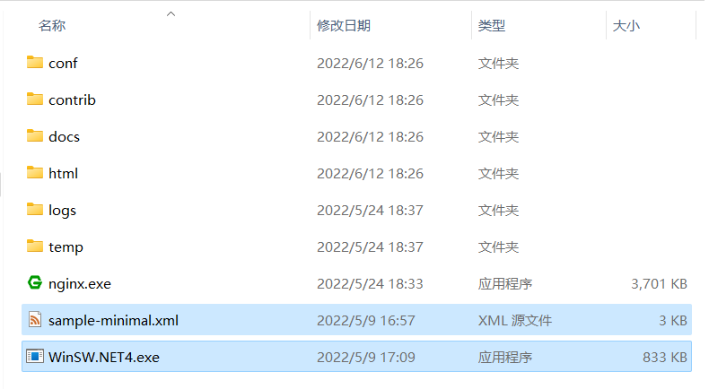
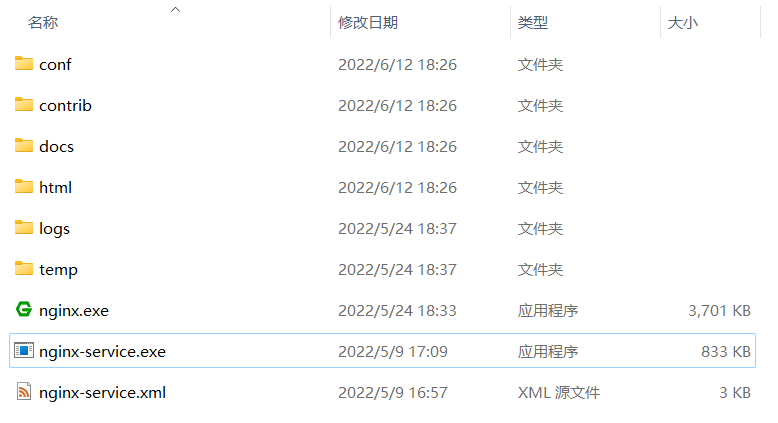
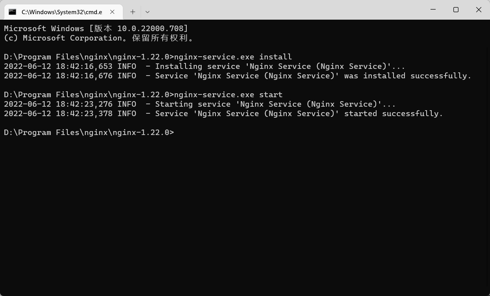
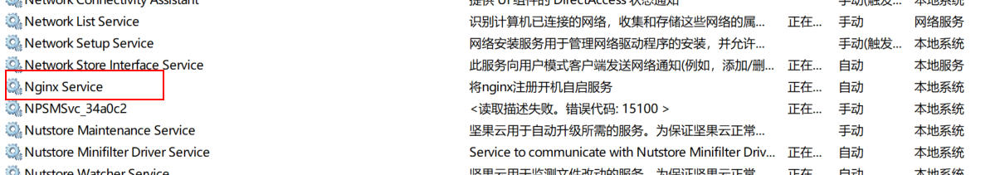

## 一、windows下安装好nginx，并配置环境变量




## 二、查看当前windows环境中安装的.NET Framework版本

**在资源管理器中输入如下地址**

> C:\Windows\Microsoft.NET\Framework

**查看该文件夹下的.net framework安装情况**




## 三、选择对应版本的启动文件及配置文件复制到nginx目录下



**重命名启动文件与配置文件为同一名称，可取任意名称，保持一致即可**




## 四、修改配置文件，内容可参照下文

``` xml
<service>
  <!-- 服务的ID，他必须在当前系统中是独一无二的 -->
  <id>Nginx Service</id>
  <!-- 服务中所展示的名称 -->
  <name>Nginx Service</name>
  <!-- 服务的相关描述 -->
  <description>将nginx注册开机自启服务</description>
  <!-- 执行文件所在的目录，启动文件为nginx.exe，NGINX_HOME为全局nginx环境变量 -->
  <executable>%NGINX_HOME%\nginx.exe</executable>
  <!-- 启动参数 -->
  <startarguments></startarguments>
  <!-- 停止服务的执行文件，也是nginx.exe -->
  <stopexecutable>%NGINX_HOME%\nginx.exe</stopexecutable>
  <!-- 停止nginx的参数 -->
  <stoparguments>-s stop</stoparguments>
  <!-- 配置输出日志的目录，BASE表示当前项目目录，日志包括winsw启动日志，项目启动日志 -->
  <logpath>%BASE%\winsw_logs</logpath>
  <!-- 日志存储方式，reset为每次启动覆盖上一次的日志 -->
  <log mode="reset"></log>
</service>
```


## 五、在当前目录下打开终端，输入注册服务与启动服务命令

**注册服务命令**

> nginx-service.exe install

**启动服务命令**

> nginx-service.exe start




**nginx成功注册到windows系统中且启动成功，后续可以在系统服务中找到注册好的服务**

