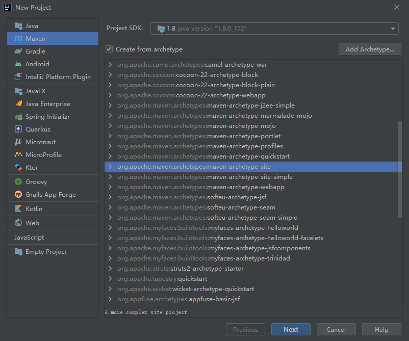
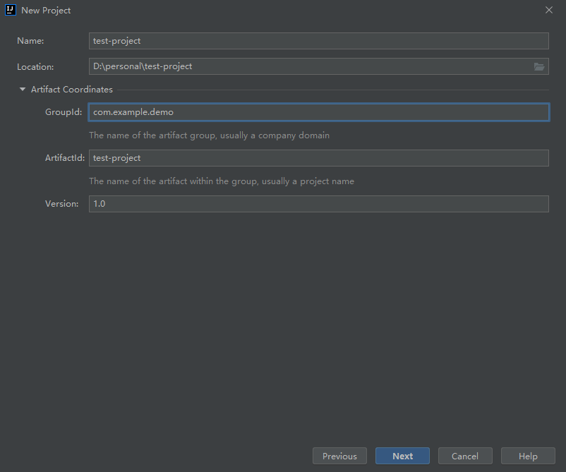
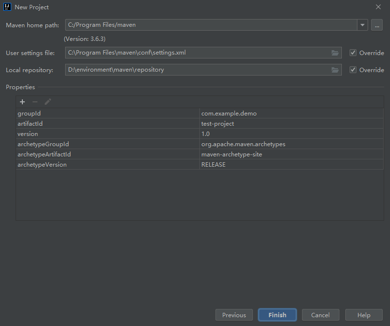
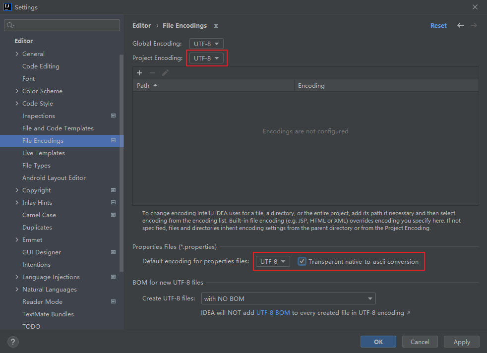
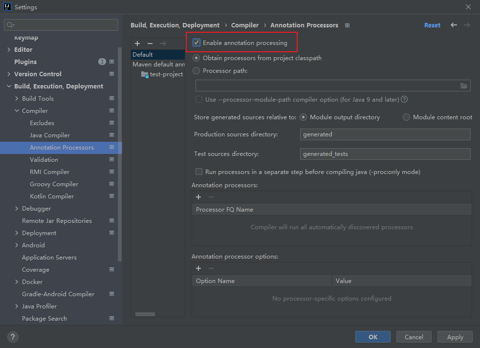
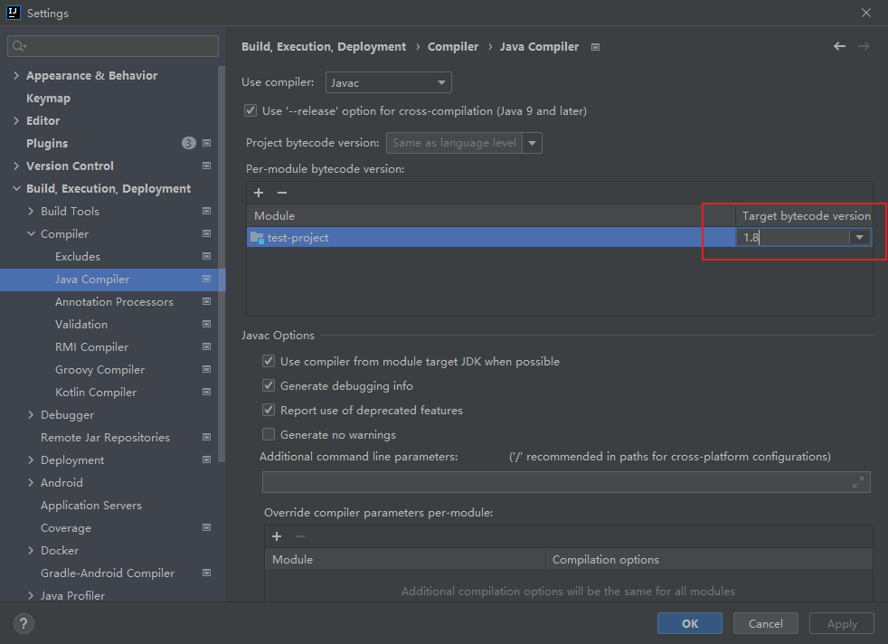
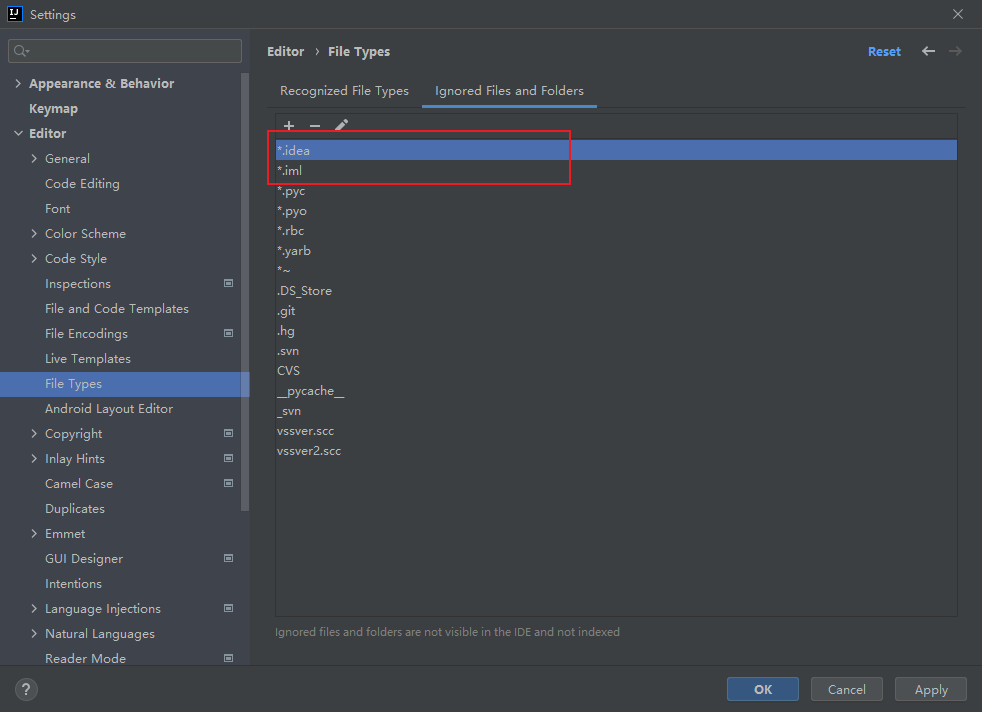

# Maven父子项目搭建指南


### 1. New Project

创建Maven项目，确定jdk版本为1.8，勾选从原型创建，选择maven-archetype-site原型。



maven提供的41个骨架原型见附录。

### 2. 项目命名

为项目命名，选择项目所在目录，并设置项目的GAV（groupId,artifactId,version）。



### 3. 选择maven版本

选用本地安装的maven与引用的repository。



### 4.修改字符编码

将项目的文件编码修改为UTF-8。



### 5. 注解生效

注解生效激活。



### 6. Java编译版本

java编译版本选8。



### 7. File Type过滤

将`*.idea`、`*.iml`等不要展示的文件隐藏掉。



### 8. 编写父工程POM文件

pom.xml文件示例如下：

``` xml
<?xml version="1.0" encoding="UTF-8"?>

<project xmlns="http://maven.apache.org/POM/4.0.0" xmlns:xsi="http://www.w3.org/2001/XMLSchema-instance"
  xsi:schemaLocation="http://maven.apache.org/POM/4.0.0 http://maven.apache.org/xsd/maven-4.0.0.xsd">
  <modelVersion>4.0.0</modelVersion>

  <groupId>org.cqcca.project</groupId>
  <artifactId>cqcca-task-manage</artifactId>
  <packaging>pom</packaging>
  <version>1.0-SNAPSHOT</version>

  <modules>
    <module>cqcca-task-manage-common</module>
    <module>cqcca-task-manage-modules</module>
    <module>cqcca-task-manage-web</module>
  </modules>

  <name>Maven</name>
  <!-- FIXME change it to the project's website -->
  <url>http://maven.apache.org/</url>
  <inceptionYear>2001</inceptionYear>

  <parent>
    <groupId>org.springframework.boot</groupId>
    <artifactId>spring-boot-starter-parent</artifactId>
    <version>2.6.4</version>
  </parent>

  <distributionManagement>
    <site>
      <id>website</id>
      <url>scp://webhost.company.com/www/website</url>
    </site>
  </distributionManagement>

  <properties>
    <project.build.sourceEncoding>UTF-8</project.build.sourceEncoding>
    <mysql.version>8.0.26</mysql.version>
    <sqlserver.version>9.2.1.jre8</sqlserver.version>
    <druid.version>1.2.8</druid.version>
    <mybatis.version>2.2.0</mybatis.version>
    <mybatis-plus.version>3.4.1</mybatis-plus.version>
    <lombok.version>1.18.22</lombok.version>
    <commons-lang3.version>3.12.0</commons-lang3.version>
    <commons-pool.version>1.6</commons-pool.version>
    <commons-pool2.version>2.9.0</commons-pool2.version>
    <mapstruct.version>1.4.1.Final</mapstruct.version>
    <knife4j.version>2.0.7</knife4j.version>
  </properties>

  <dependencyManagement>
    <dependencies>
      <!-- druid 数据源驱动 -->
      <dependency>
        <groupId>com.alibaba</groupId>
        <artifactId>druid-spring-boot-starter</artifactId>
        <version>${druid.version}</version>
      </dependency>
      <!-- mysql数据源 -->
      <dependency>
        <groupId>mysql</groupId>
        <artifactId>mysql-connector-java</artifactId>
        <version>${mysql.version}</version>
        <scope>runtime</scope>
      </dependency>
      <!-- sqlserver数据源 -->
      <dependency>
        <groupId>com.microsoft.sqlserver</groupId>
        <artifactId>mssql-jdbc</artifactId>
        <version>${sqlserver.version}</version>
        <scope>runtime</scope>
      </dependency>
      <!-- mybatis引用 -->
      <dependency>
        <groupId>org.mybatis.spring.boot</groupId>
        <artifactId>mybatis-spring-boot-starter</artifactId>
        <version>${mybatis.version}</version>
      </dependency>
      <!-- mybatis-plus引用 -->
      <dependency>
        <groupId>com.baomidou</groupId>
        <artifactId>mybatis-plus-boot-starter</artifactId>
        <version>${mybatis-plus.version}</version>
      </dependency>
      <!-- mybatis-plus-generator -->
      <dependency>
        <groupId>com.baomidou</groupId>
        <artifactId>mybatis-plus-generator</artifactId>
        <version>${mybatis-plus.version}</version>
      </dependency>
      <!-- log4j依赖 2.16.0 -->
      <dependency>
        <groupId>org.apache.logging.log4j</groupId>
        <artifactId>log4j-to-slf4j</artifactId>
        <version>${log4j2.version}</version>
      </dependency>
      <!-- lombok 简化开发 -->
      <dependency>
        <groupId>org.projectlombok</groupId>
        <artifactId>lombok</artifactId>
        <version>${lombok.version}</version>
        <scope>provided</scope>
      </dependency>
      <!-- 常用工具库 -->
      <dependency>
        <groupId>org.apache.commons</groupId>
        <artifactId>commons-lang3</artifactId>
        <version>${commons-lang3.version}</version>
      </dependency>
      <!-- 通用对象池 -->
      <dependency>
        <groupId>commons-pool</groupId>
        <artifactId>commons-pool</artifactId>
        <version>${commons-pool.version}</version>
      </dependency>
      <dependency>
        <groupId>org.apache.commons</groupId>
        <artifactId>commons-pool2</artifactId>
        <version>${commons-pool2.version}</version>
      </dependency>
      <!--mapStruct依赖-->
      <dependency>
        <groupId>org.mapstruct</groupId>
        <artifactId>mapstruct</artifactId>
        <version>${mapstruct.version}</version>
      </dependency>
      <!-- 注解处理器，根据注解自动生成mapper的实现 -->
      <dependency>
        <groupId>org.mapstruct</groupId>
        <artifactId>mapstruct-processor</artifactId>
        <version>${mapstruct.version}</version>
        <scope>provided</scope>
      </dependency>
      <!-- knife4j 接口文档 -->
      <dependency>
        <groupId>com.github.xiaoymin</groupId>
        <artifactId>knife4j-spring-boot-starter</artifactId>
        <version>${knife4j.version}</version>
      </dependency>
    </dependencies>
  </dependencyManagement>
</project>

```


### 附录

#### maven提供的41个骨架原型分别是：

1. internal -> appfuse-basic-jsf (创建一个基于Hibernate，Spring和JSF的Web应用程序的原型) 
2. internal -> appfuse-basic-spring (创建一个基于Hibernate，Spring和Spring MVC的Web应用程序的原型) 
3. internal -> appfuse-basic-struts (创建一个基于Hibernate，Spring和Struts 2的Web应用程序的原型) 
4. internal -> appfuse-basic-tapestry (创建一个基于Hibernate, Spring 和 Tapestry 4的Web应用程序的原型) 
5. internal -> appfuse-core (创建一个基于 Hibernate and Spring 和 XFire的jar应用程序的原型) 
6. internal -> appfuse-modular-jsf (创建一个基于 Hibernate，Spring和JSF的模块化应用原型) 
7. internal -> appfuse-modular-spring (创建一个基于 Hibernate, Spring 和 Spring MVC 的模块化应用原型) 
8. internal -> appfuse-modular-struts (创建一个基于 Hibernate, Spring 和 Struts 2 的模块化应用原型) 
9. internal -> appfuse-modular-tapestry (创建一个基于 Hibernate, Spring 和 Tapestry 4 的模块化应用原型) 
10. internal -> maven-archetype-j2ee-simple (一个简单的J2EE的Java应用程序) 
11. internal -> maven-archetype-marmalade-mojo (一个Maven的 插件开发项目 using marmalade) 
12. internal -> maven-archetype-mojo (一个Maven的Java插件开发项目) 
13. internal -> maven-archetype-portlet (一个简单的portlet应用程序) 
14. internal -> maven-archetype-profiles () 
15. internal -> maven-archetype-quickstart () 
16. internal -> maven-archetype-site-simple (简单的网站生成项目) 
17. internal -> maven-archetype-site (更复杂的网站项目) 
18. internal -> maven-archetype-webapp (一个简单的Java Web应用程序) 
19. internal -> jini-service-archetype (Archetype for Jini service project creation) 
20. internal -> softeu-archetype-seam (JSF+Facelets+Seam Archetype) 
21. internal -> softeu-archetype-seam-simple (JSF+Facelets+Seam (无残留) 原型) 
22. internal -> softeu-archetype-jsf (JSF+Facelets 原型) 
23. internal -> jpa-maven-archetype (JPA 应用程序) 
24. internal -> spring-osgi-bundle-archetype (Spring-OSGi 原型) 
25. internal -> confluence-plugin-archetype (Atlassian 聚合插件原型) 
26. internal -> jira-plugin-archetype (Atlassian JIRA 插件原型) 
27. internal -> maven-archetype-har (Hibernate 存档) 
28. internal -> maven-archetype-sar (JBoss 服务存档) 
29. internal -> wicket-archetype-quickstart (一个简单的Apache Wicket的项目) 
30. internal -> scala-archetype-simple (一个简单的scala的项目) 
31. internal -> lift-archetype-blank (一个 blank/empty liftweb 项目) 
32. internal -> lift-archetype-basic (基本（liftweb）项目) 
33. internal -> cocoon-22-archetype-block-plain ([http://cocoapacorg2/maven-plugins/]) 
34. internal -> cocoon-22-archetype-block ([http://cocoapacorg2/maven-plugins/]) 
35. internal -> cocoon-22-archetype-webapp ([http://cocoapacorg2/maven-plugins/]) 
36. internal -> myfaces-archetype-helloworld (使用MyFaces的一个简单的原型) 
37. internal -> myfaces-archetype-helloworld-facelets (一个使用MyFaces和Facelets的简单原型) 
38. internal -> myfaces-archetype-trinidad (一个使用MyFaces和Trinidad的简单原型) 
39. internal -> myfaces-archetype-jsfcomponents (一种使用MyFaces创建定制JSF组件的简单的原型) 
40. internal -> gmaven-archetype-basic (Groovy的基本原型) 
41. internal -> gmaven-archetype-mojo (Groovy mojo 原型)

#### 在spring-boot-dependencies中已添加的常用starter

以下starter，当父项目配置spring-boot-starter-parent后，可以在子模块中直接引用，无需再声明版本号。

``` xml
<!-- springboot 热部署 -->
<dependency>
    <groupId>org.springframework.boot</groupId>
    <artifactId>spring-boot-devtools</artifactId>
    <version>2.5.4</version>
</dependency>
<!-- springboot aop 切面编程 -->
<dependency>
    <groupId>org.springframework.boot</groupId>
    <artifactId>spring-boot-starter-aop</artifactId>
    <version>2.5.4</version>
</dependency>
<!-- springboot cache 数据缓存操作 -->
<dependency>
    <groupId>org.springframework.boot</groupId>
    <artifactId>spring-boot-starter-cache</artifactId>
    <version>2.5.4</version>
</dependency>
<!-- elasticsearch 分布式搜索 -->
<dependency>
    <groupId>org.springframework.boot</groupId>
    <artifactId>spring-boot-starter-data-elasticsearch</artifactId>
    <version>2.5.4</version>
</dependency>
<!-- jpa 数据库操作 -->
<dependency>
    <groupId>org.springframework.boot</groupId>
    <artifactId>spring-boot-starter-data-jpa</artifactId>
    <version>2.5.4</version>
</dependency>
<dependency>
    <groupId>com.h2database</groupId>
    <artifactId>h2</artifactId>
    <version>${h2.version}</version>
</dependency>
<!-- mongodb 文档数据库操作 -->
<dependency>
    <groupId>org.springframework.boot</groupId>
    <artifactId>spring-boot-starter-data-mongodb</artifactId>
    <version>2.5.4</version>
</dependency>
<!-- redis操作 默认客户端驱动为lettuce -->
<dependency>
    <groupId>org.springframework.boot</groupId>
    <artifactId>spring-boot-starter-data-redis</artifactId>
    <version>2.5.4</version>
</dependency>
<!-- freemarker 模板生成工具 -->
<dependency>
    <groupId>org.springframework.boot</groupId>
    <artifactId>spring-boot-starter-freemarker</artifactId>
    <version>2.5.4</version>
</dependency>
<!-- log4j 日志 -->
<dependency>
    <groupId>org.springframework.boot</groupId>
    <artifactId>spring-boot-starter-log4j2</artifactId>
    <version>2.5.4</version>
</dependency>
<!-- springboot 邮件发送 -->
<dependency>
    <groupId>org.springframework.boot</groupId>
    <artifactId>spring-boot-starter-mail</artifactId>
    <version>2.5.4</version>
</dependency>
<!-- springboot quartz 定时任务 -->
<dependency>
    <groupId>org.springframework.boot</groupId>
    <artifactId>spring-boot-starter-quartz</artifactId>
    <version>2.5.4</version>
</dependency>
<!-- springboot 安全认证 -->
<dependency>
    <groupId>org.springframework.boot</groupId>
    <artifactId>spring-boot-starter-security</artifactId>
    <version>2.5.4</version>
</dependency>
<!-- springboot test 单元测试 -->
<dependency>
    <groupId>org.springframework.boot</groupId>
    <artifactId>spring-boot-starter-test</artifactId>
    <version>2.5.4</version>
</dependency>
<!-- springboot thymeleaf 前端页面模板 -->
<dependency>
    <groupId>org.springframework.boot</groupId>
    <artifactId>spring-boot-starter-thymeleaf</artifactId>
    <version>2.5.4</version>
</dependency>
<!-- springboot 数据校验 -->
<dependency>
    <groupId>org.springframework.boot</groupId>
    <artifactId>spring-boot-starter-validation</artifactId>
    <version>2.5.4</version>
</dependency>
<!-- springboot web启动器 -->
<dependency>
    <groupId>org.springframework.boot</groupId>
    <artifactId>spring-boot-starter-web</artifactId>
    <version>2.5.4</version>
</dependency>
<!-- springboot websocket -->
<dependency>
    <groupId>org.springframework.boot</groupId>
    <artifactId>spring-boot-starter-websocket</artifactId>
    <version>2.5.4</version>
</dependency>
```


#### 在spring-boot-dependencies中已添加的其他常用工具

以下工具已在spring-boot-dependencies中声明版本，当父项目配置spring-boot-starter-parent后，可以在子模块中直接引用，无需再声明版本号。

``` xml
<!-- sqlserver数据源 -->
<dependency>
    <groupId>com.microsoft.sqlserver</groupId>
    <artifactId>mssql-jdbc</artifactId>
    <version>${mssql-jdbc.version}</version>
</dependency>
<!-- mysql数据源 -->
<dependency>
    <groupId>mysql</groupId>
    <artifactId>mysql-connector-java</artifactId>
    <version>${mysql.version}</version>
    <exclusions>
        <exclusion>
            <groupId>com.google.protobuf</groupId>
            <artifactId>protobuf-java</artifactId>
        </exclusion>
    </exclusions>
</dependency>
<!-- 常用工具库 -->
<dependency>
    <groupId>org.apache.commons</groupId>
    <artifactId>commons-lang3</artifactId>
    <version>${commons-lang3.version}</version>
</dependency>
<!-- 通用对象池 -->
<dependency>
    <groupId>commons-pool</groupId>
    <artifactId>commons-pool</artifactId>
    <version>${commons-pool.version}</version>
</dependency>
<dependency>
    <groupId>org.apache.commons</groupId>
    <artifactId>commons-pool2</artifactId>
    <version>${commons-pool2.version}</version>
</dependency>
<!-- log4j依赖 修复漏洞需要升级为2.16.0 -->
<dependency>
    <groupId>org.apache.logging.log4j</groupId>
    <artifactId>log4j-to-slf4j</artifactId>
    <version>${log4j2.version}</version>
</dependency>
<!-- lombok简化开发 -->
<dependency>
    <groupId>org.projectlombok</groupId>
    <artifactId>lombok</artifactId>
    <version>${lombok.version}</version>
</dependency>
<!-- quartz定时任务 -->
<dependency>
    <groupId>org.quartz-scheduler</groupId>
    <artifactId>quartz</artifactId>
    <version>${quartz.version}</version>
    <exclusions>
        <exclusion>
            <groupId>com.mchange</groupId>
            <artifactId>c3p0</artifactId>
        </exclusion>
        <exclusion>
            <groupId>com.zaxxer</groupId>
            <artifactId>*</artifactId>
        </exclusion>
    </exclusions>
</dependency>
<dependency>
    <groupId>org.quartz-scheduler</groupId>
    <artifactId>quartz-jobs</artifactId>
    <version>${quartz.version}</version>
</dependency>
```

