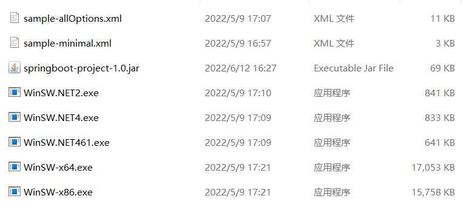
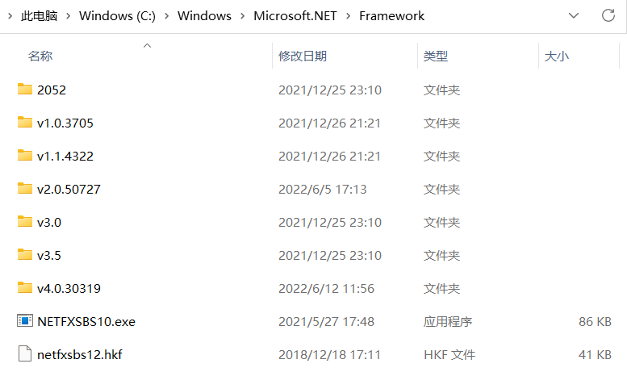
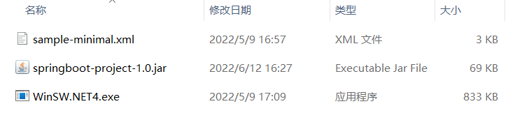
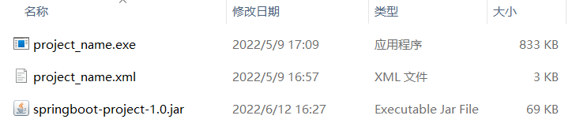
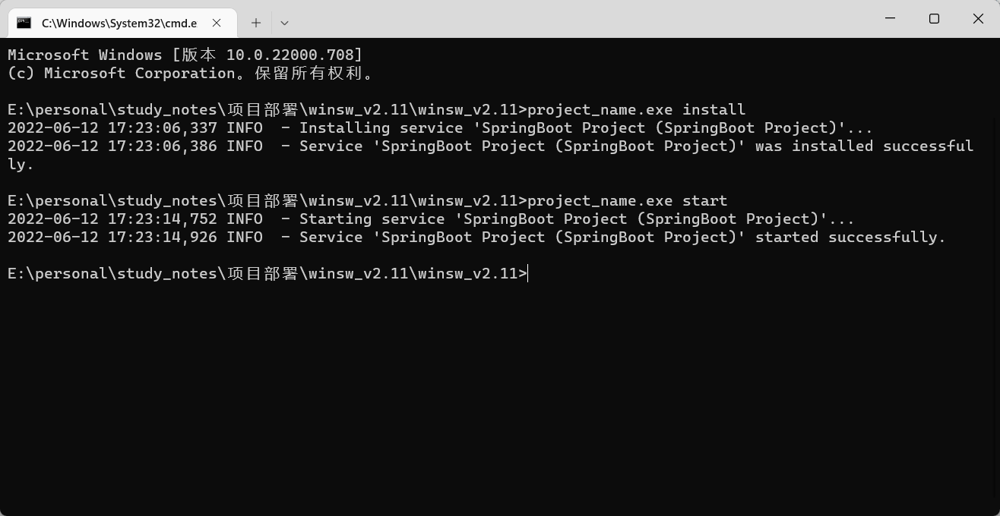
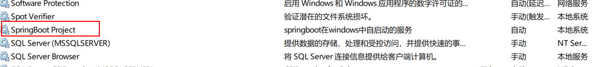

## 一、将winsw解压，与打包好的jar包放在同一目录下




## 二、查看当前windows环境中安装的.NET Framework版本

**在资源管理器中输入如下地址**

> C:\Windows\Microsoft.NET\Framework

**查看该文件夹下的.net framework安装情况**




## 三、根据最高版本选择对应的启动文件，并删去多余文件。



**重命名启动文件与配置文件为同一名称，可取任意名称，保持一致即可**




## 四、修改配置文件，内容可参照下文

``` xml
<service>
  <!-- 服务的ID，他必须在当前系统中是独一无二的 -->
  <id>SpringBoot Project</id>
  <!-- 服务中所展示的名称 -->
  <name>SpringBoot Project</name>
  <!-- 服务的相关描述 -->
  <description>springboot在windows中自启动的服务</description>
  <!-- 执行文件所在的目录，springboot项目一般为java.exe，JAVA_HOME为全局java环境变量 -->
  <executable>%JAVA_HOME%\bin\java.exe</executable>
  <!-- 启动springboot项目所带的参数 -->
  <arguments>-jar -Dserver.port=8080 -Dspring.profiles.active=test "springboot-project-1.0.jar"</arguments>
  <!-- 服务启动模式为开机自启 -->
  <startmode>Automatic</startmode>
  <!-- 配置输出日志的目录，BASE表示当前项目目录，日志包括winsw启动日志，项目启动日志 -->
  <logpath>%BASE%\logs</logpath>
  <!-- 日志存储方式，reset为每次启动覆盖上一次的日志 -->
  <log mode="reset"></log>
</service>
```


## 五、在当前目录下打开终端，输入注册服务与启动服务命令

**注册服务命令**

> project_name.exe install

**启动服务命令**

> project_name.exe start




**项目成功注册到windows系统中且启动成功，后续可以在系统服务中找到注册好的服务**


